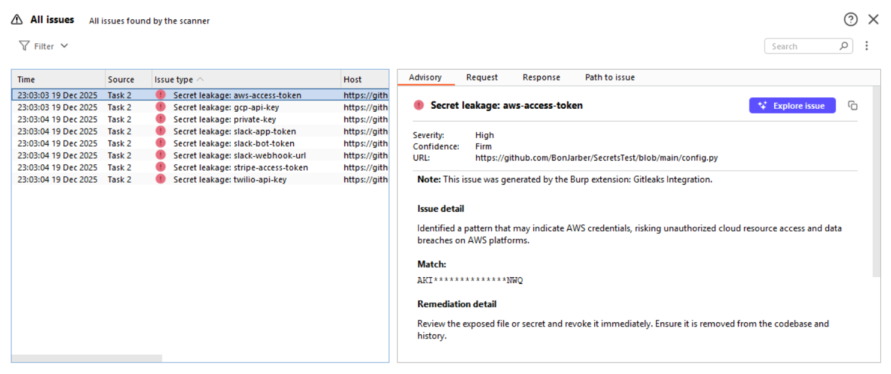
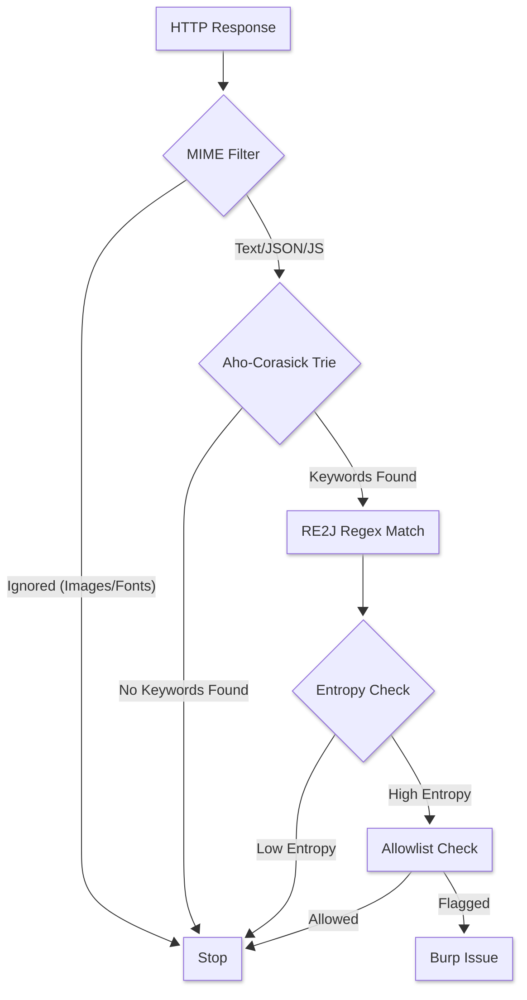
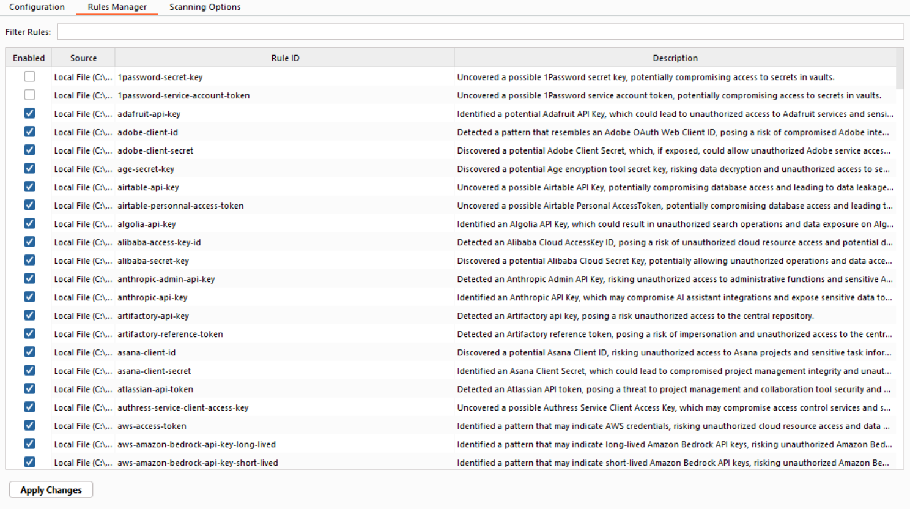
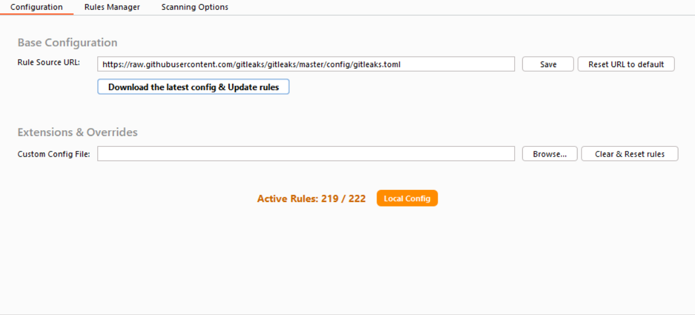
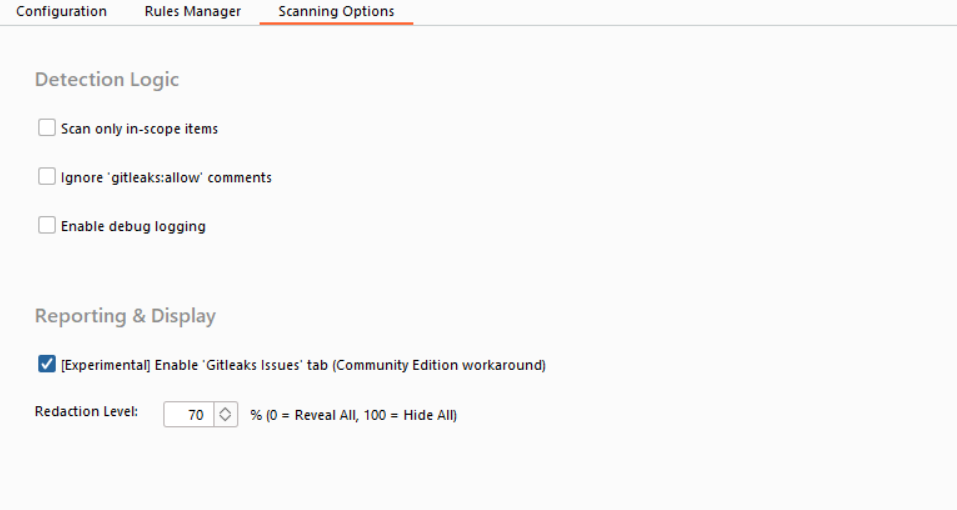
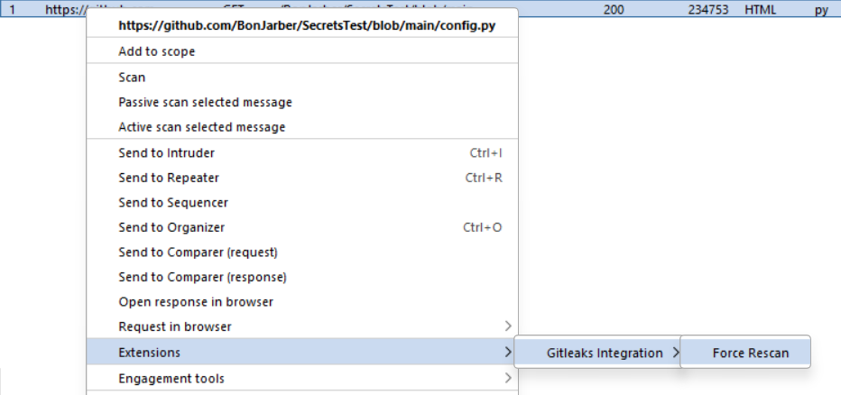
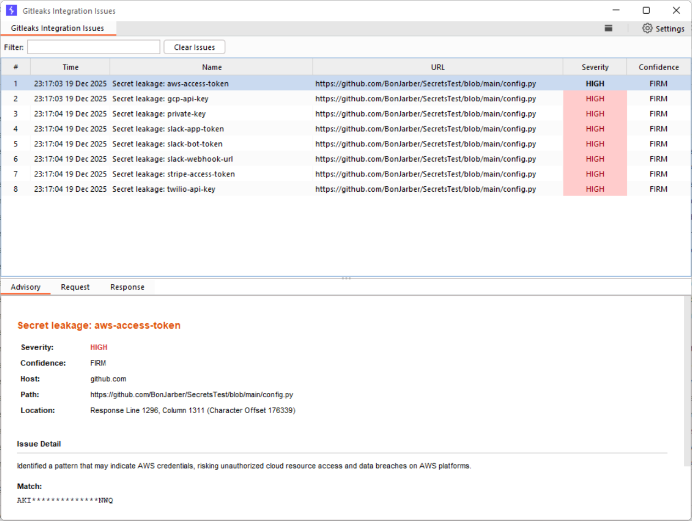

# Burp Suite Gitleaks Extension

A native, high-performance Java extension for Burp Suite that brings the power of [Gitleaks](https://github.com/gitleaks/gitleaks) into your passive scanning workflow.

> [!IMPORTANT]
> Disclaimer! 
>
> This is an **unofficial** project. I am not a developer for Gitleaks, nor am I affiliated with the Gitleaks team. I am simply a security engineer who uses gitleaks daily and wanted a native integration for Burp Suite that didn't rely on external binaries or Python wrappers.



## Why another secret scanner? (vs. [TruffleHog](https://github.com/trufflesecurity/trufflehog-burp-suite-extension))

While [the TruffleHog extension](https://github.com/trufflesecurity/trufflehog-burp-suite-extension) exists, this project takes a different architectural approach focused on performance and native integration:

1. **Pure Java** - this runs entirely within the Burp JVM using Montoya API. There is no need to install Go, Python, or manage external `gitleaks` binaries/processes.
2. **Safety (RE2J)** - unlike standard Java Regex (which can cause some issues with scanning large minified JS files), this extension uses Google's *RE2J*. This guarantees linear-time regex execution, ensuring Burp never freezes on complex inputs.
3. **Performance** - adopting the optimization strategy from gitleaks core, we use the Aho-Corasick algorithm to pre-filter responses. Regexes are only attempted if specific keywords exist, keeping the passive scan speed blazing fast (`O(n)`).
4. **Direct TOML Support** - the extension parses the official [gitleaks.toml](https://raw.githubusercontent.com/gitleaks/gitleaks/master/config/gitleaks.toml) directly. You can fetch the latest rules from the official repo with one click, or load your own custom configuration file on top of the default one.

## How it works?

The extension hooks into Burp's Passive Scan engine.



- **MIME Filtering** - tatic assets (images, fonts, videos) are immediately discarded to save cycles.

- **Aho-Corasick pre-scan** - the response body is streamed through an Aho-Corasick Trie containing keywords from all active rules. If no keywords match, the scan stops immediately.

- **RE2J regex matching** - if keywords are found, only the relevant linear-time regexes are executed against the content.

- **Entropy calculation** - high-confidence matches are further validated using Shannon Entropy calculation to reduce false positives on random strings.

- **Allowlisting** - it respects `gitleaks:allow` comments in-line and supports global allowlists defined in the TOML configuration.

## Features

- **Native Montoya API** - built on the modern Burp API for future-proof compatibility.
- **Community Edition support** - automatically detects Burp Suite Community Edition and registers a manual traffic handler, ensuring traffic is scanned even without the Pro/Enterprise-only Passive Scanner.
- **Dedicated Issues tab** - an optional, experimental, standalone tab to view and manage findings separately from the main Burp Dashboard (which can be useful in the Community Edition).
- **Safe verification** - integrated context menu actions to verify secrets via Burp Repeater or step-by-step guides without triggering automatic active scanning.
- **Base64 support** - automatically detects and **recursively** scans Base64 encoded payloads (up to depth 2).
- **Rule management**:
    - Auto-fetch the latest official Gitleaks rules.
    - Load custom/company-specific `.toml` configs.
    - Disable specific rules via the UI.
- **Context menu** - right-click any request in Burp to "Force Rescan" specific items.











## Secret verification

The extension provides a safe, "human-in-the-loop" workflow to confirm if a detected secret is active. It does not automatically send traffic to third parties to avoid accidental account lockouts or unauthorized scanning.

Right-click any finding in the Gitleaks Issues tab or Burp's Issues pane to access verification options:

- **Send to Repeater** - for standard API keys (e.g. Stripe, Slack) the extension builds a valid HTTP request (with headers/body pre-filled) and opens it in a new Repeater tab. You just confirm it and click "Send".
- **Copy verification cURL** - copies the equivalent curl command to your clipboard for quick verification in a terminal.
- **Show verification steps** - for complex cases (e.g. AWS) that require browser interaction or specific tools, a dialog appears with step-by-step instructions.

Verification templates are defined in `src/main/resources/verification/*.toml` and can be easily extended by the community.

## Credits & Acknowledgments

All credit for the detection logic and rule definitions goes to the Gitleaks Team and the contributors of the [Gitleaks](https://github.com/gitleaks/gitleaks/) project.

- **Rules** - the default configuration is sourced directly from the Gitleaks repository.
- **Logic** - the Shannon Entropy calculation and the Aho-Corasick pre-filtering strategy are direct ports/adaptations of the Gitleaks implementation.
- **License** - this project includes [the original Gitleaks MIT License](src/main/resources/GITLEAKS_LICENSE) regarding the usage of their logic and configuration format.

Verification steps are mostly inspired by [keyhacks](https://github.com/streaak/keyhacks) repository.

## Installation

1. Download the latest `burp-gitleaks-integration.jar` from the [Releases](https://github.com/TheArqsz/BurpSuite-Gitleaks-Extension/releases) page.
2. Open Burp Suite -> Extensions -> Add.
3. Select Java and choose the downloaded JAR file.

## Configuration

Navigate to the `Gitleaks Integration Settings` tab in Burp Suite.

- **Rule Source** - click "Update" to pull the latest definitions from the official Gitleaks repository.
- **Custom Config** - specify a local path to a custom `gitleaks.toml` to override or extend the defaults.
- **Redaction** - adjust the percentage of the secret masked in the Burp Issue view.
- **Issues Tab** - Toggle the experimental "Issues" tab.

## Building from source

Requirements: JDK 17+ and Maven.

```bash
mvn clean package -DskipTests
```

The compiled JAR will be in the `target/` directory.

## License

This project is licensed under [the MIT License](LICENSE.md).
